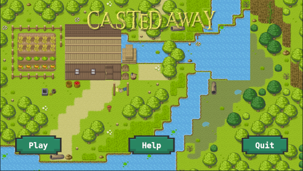

# Casted Away

Created for [Pyweek30](https://pyweek.org/30/)
by team **Dunder Mifflin**: Nikola (lead), jimthejelly, Taganov, fury, Imperfect_One 

## Setting

**Spain, The Age of Discovery**

Your family was cast away because they're of mixed Spanish and New World. In
the Casta system of Spain, they rank low. People of the village didn't accept
other races because old times, and cast the whole family out. Now they live
by themselves by a river where they harvest crops and fish for a living.

https://en.wikipedia.org/wiki/Casta

## Running

requirements.txt

    cffi==1.14.3
    pycparser==2.20
    pygame==1.9.6
    pygame-gui==0.5.7
    pymunk==5.7.0
    PyTMX==3.21.7
    six==1.15.0

Install requirements and run.

    pip install -r requirements.txt
    python run_game.py

Or do it in a virtualenv to keep it clean.

## Controls and Gameplay

Click people to select them. Click the ground to make them move there.  Click
**FEED** on the sidebar to give them food from the **resources**.  Move
them to the farm or the river to **gather** food or water which is added to
the resources.

When people run out of food they start starving and will **die**. Keep
them **alive**!

## Content & Warnings

This game explores historical racial issues. We want to raise awareness of
the issues of the past and present, and do not intend any harm to anyone. We
hope this game may inspire some to do further reasearch into similar issues of
mixed-race discrimination in history.

## Licensing and Copyright

This project code is licensed under the [MIT](https://mit-license.org/)
license. Assets are licensed as specified below.

### Art Asset Links:

- Villagers: https://craftpix.net/freebies/free-villagers-sprite-sheets-pixel-art/
- Buttons: https://adwitr.itch.io/button-asset-pack
- Tiles: https://pipoya.itch.io/pipoya-rpg-tileset-32x32?download
- Soundtracks: https://www.fesliyanstudios.com/musicfiles/2020-03-22_-_8_Bit_Surf_-_FesliyanStudios.com_-_David_Renda/Slower-Tempo-2020-03-22_-_8_Bit_Surf_-_FesliyanStudios.com_-_David_Renda.mp3
https://www.fesliyanstudios.com/musicfiles/2020-03-22_-_A_Bit_Of_Hope_-_David_Fesliyan/Slower-Tempo-2020-03-22_-_A_Bit_Of_Hope_-_David_Fesliyan.mp3
https://www.fesliyanstudios.com/musicfiles/2019-08-25_-_8bit-Smooth_Presentation_-_David_Fesliyan.mp3